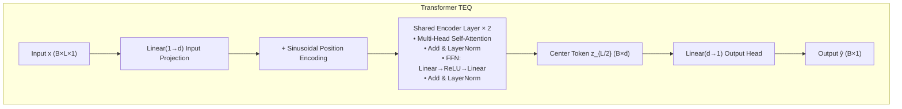
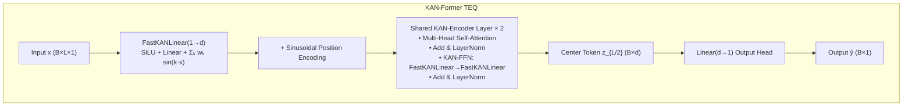
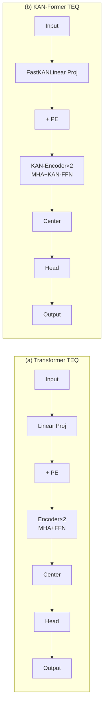

# 均衡器结构对比流程图（论文用）

以下为 Mermaid 流程图源码。可复制到 [Mermaid Live Editor](https://mermaid.live) 或 Typora / VS Code 等支持 Mermaid 的编辑器中渲染，并导出为 PNG/SVG 插入论文。

---

## (a) 左图：Transformer TEQ

---

## (b) 右图：KAN-Former TEQ

---

## 并排对比（单图，可选）

若需在一张图内左右并排，可使用下方代码（部分渲染器支持 subgraph 左右排列）：

---

**说明**：论文中建议分别渲染 (a)(b) 两张图，在正文中并排插入，图注为 “(a) Transformer TEQ 结构；(b) KAN-Former TEQ 结构”。
